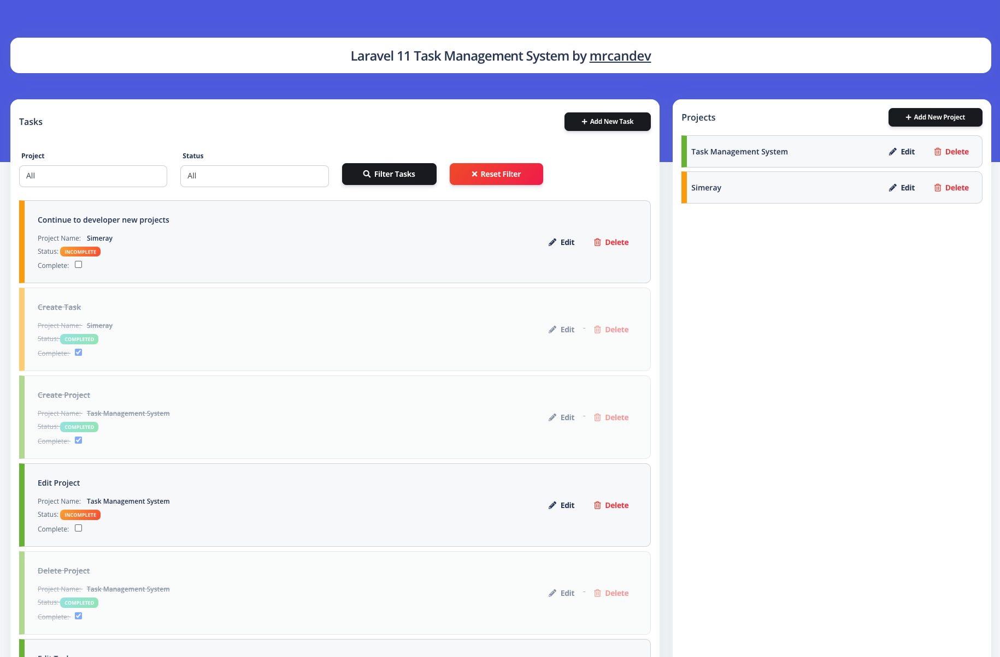
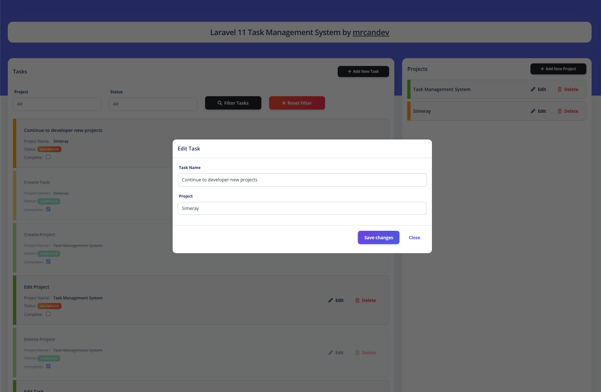

# Laravel Task Management System

In this repo I developed a Task Management System with Laravel 11. You can control or contribute to the use of Model, Ajax, Controller.
## Demo Video
[](https://www.youtube.com/watch?v=_pf5jAt-eiw)

## Screenshots

Laravel 11 Task Management System Screenshot


Laravel 11 Task Management System Screenshot 2



## Features
- Create Project
- Edit Project
- Delete Project
- Create Task
- Edit Task
- Delete Task
- Sorting with Drag and Drop System
- Status Update
- Filter by Status


## Table of Contents
- [Prerequisites](#prerequisites)
- [Installation](#installation)
- [Usage](#usage)
- [Contributing](#contributing)
- [Supporting](#supporting)
- [License](#license)

## Prerequisites
Before you begin, ensure you have met the following requirements:
- PHP >= 8.2 
- MySQL
- Composer installed globally

## Installation
To install and set up the project locally, follow these steps:

1. Clone the repository:
   ```bash
   git clone https://github.com/mrcandev/Laravel-Task-Management-Example.git

2. Navigate to the project directory:
    ```bash
    cd project_folder

3. Install PHP dependencies:
    ```bash
    composer install

4. Set up your environment variables:
    ```bash
    cp .env.example .env
    php artisan key:generate

5. Run migrations (optional):
    ```bash
    php artisan migrate


## Usage
To install and set up the project locally, follow these steps:
1. To run the application, use the following command:
    ```bash
    php artisan serve

Visit http://localhost:8000 in your web browser to view the application.


## Contributing
Contributions are welcome! Here's how you can contribute to this project:

1. Fork the repository.
2. Create a new branch (git checkout -b feature/your-feature-name).
3. Commit your changes (git commit -am 'Add some feature').
4. Push to the branch (git push origin feature/your-feature-name).
5. Create a new Pull Request.

## Copyrights
I would like to point out that I used the free Argon open source template for design. You can click on the link for other details and premium version.

Link: https://www.creative-tim.com/product/argon-dashboard


## Supporting
If you find this project useful and would like to support its development, you can:
- **Star the repository**: If you find this project helpful or interesting, please give it a star.
- **Fork and contribute**: Contributions are welcome! Feel free to fork this project and submit pull requests.
- **Donate**: If you'd like to make a monetary donation to support the developer, you can use the sponsor button on GitHub or visit the developer's profile for more options.

## License
This project is licensed under the [MIT license](https://opensource.org/licenses/MIT).
.
